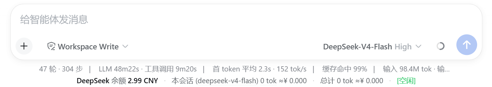
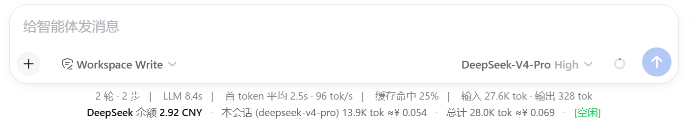
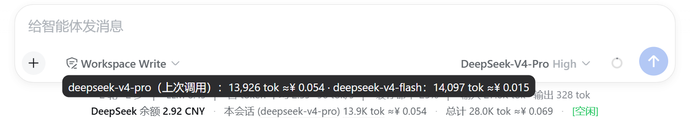
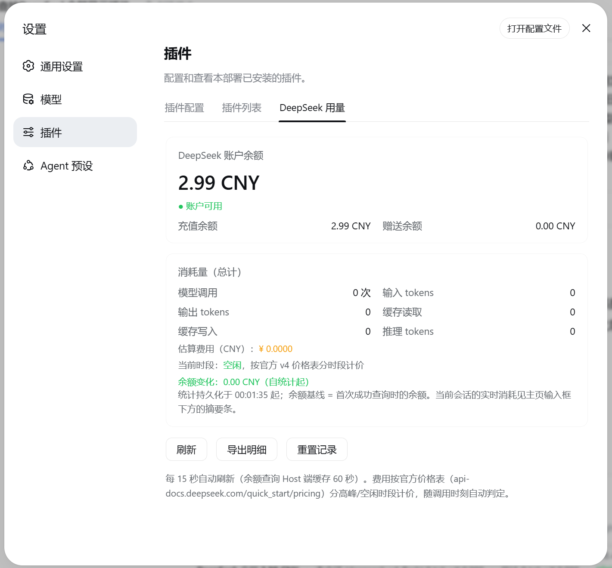
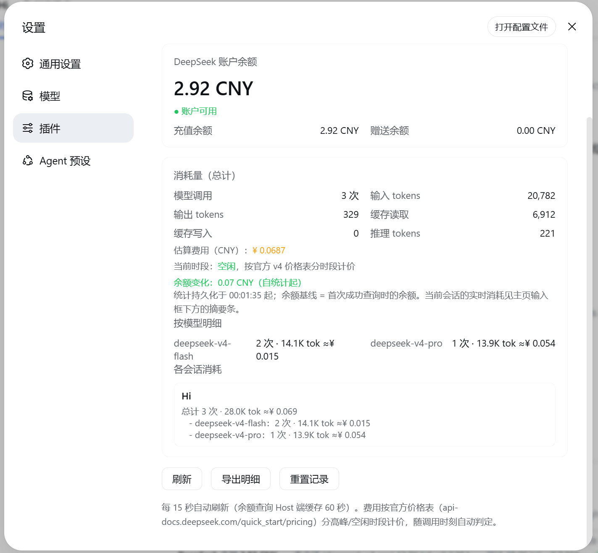

# dsh-balance-and-cost

DeepSeek Harness（DSH）标准 bundle 插件：显示 **DeepSeek 账户余额** 与 **模型消耗量**。

- 主页输入框下方实时摘要条：`DeepSeek 余额 ¥xx.xx CNY · 本会话（模型） xx.xM tok ≈¥x.xxx · 总计 xx.xM tok ≈¥x.xxx · [高峰/空闲]`（模型名跟随会话最近调用，token 按官方三档口径 M/K 缩略，悬停查看明细）
- 插件中心（设置 → 插件）「DeepSeek 用量」标签页：余额明细、按模型/按会话统计、**计价缓存按小时明细**、三档悬停、导出 CSV、重置记录
- 花费按**消耗发生时刻**的时段单价结算并写入计价缓存后冻结——高峰/空闲切换不会再让历史花费跳变

纯 JavaScript、零依赖、零构建——GitHub 直装无需构建授权。

## 界面预览

### 主页摘要条（输入框下方）

摘要条静息状态（显示会话最近使用的模型，费用记录从安装插件/重置记录起计算，无法加载历史记录）：



实际使用中的摘要条（调用次数、token 与估算费用实时更新）：



悬停 token 数字：当前模型在本会话的三档消耗明细（输入·缓存未命中 / 缓存命中 / 输出，与官方计费口径一致，三档之和 = 合计）：


悬停模型名：本会话中 deepseek-v4-flash / deepseek-v4-pro 两个模型的实际消耗对比：



### 插件中心「DeepSeek 用量」面板（设置 → 插件）

静息状态（安装/重置后尚未使用，无明细）：



使用示例（展示余额明细、按模型明细、各会话消耗明细，支持导出为CSV文件）：



## 功能特性

| 功能 | 说明 |
|---|---|
| 余额查询 | `api.deepseek.com/user/balance`，显示总余额 / 充值 / 赠送 / 可用状态（60 秒缓存） |
| 消耗量统计 | 监听 `llm/stream` 实时累计 DeepSeek 调用，按官方**三档口径**统计（输入·缓存未命中 / 缓存命中 / 输出），区分**总计**与**当前会话**，数字 M/K 缩略 |
| 按模型计价 | 按实际调用模型匹配官方价格表（支持版本后缀如 `deepseek-v4-pro-0813` 前缀匹配）；未收录模型按 deepseek-v4-flash 估算并标注 |
| 分时段计价 | 高峰（北京 9-12 / 14-18）与空闲价格不同，按**每次调用时刻**即时计价 |
| 计价缓存 | 每次消耗记录**具体时间**（北京整点）+ 当时单价，费用一经记录即**冻结**；时段切换、跨天、重启都不会改变历史花费 |
| 按小时明细 | 设置页列出最近各整点的时段、调用次数、token 与冻结费用（悬停可见当时单价快照） |
| 会话明细 | 每个会话显示真实标题、总计行与**分模型行**（flash/pro 固定列出，未调用显示 0 占位） |
| 三档悬停 | 摘要条 token 数字悬停显示三档明细（含各档费用，三档之和 = 合计）；模型名悬停显示两模型对比 |
| 导出明细 | 一键导出 CSV（按时段 + 按模型 + 按会话，三档口径，带 BOM 可直接用 Excel 打开） |
| 重置记录 | 一键清空全部统计、计价缓存与余额基线（带确认，落盘持久化） |
| 持久化 | 统计与计价缓存落盘 `$DSH_HOME/dsh-balance-and-cost.json`，进程重启后恢复 |
| 实时更新 | 模型选择 / 用量产生经 SSE 实时推送（浏览器立即刷新）；15 秒轮询作为断连兜底；余额 Host 端 60 秒缓存 |

## 计价缓存（为什么花费不会突变）

DeepSeek 价格分高峰/空闲两档。如果展示时用「当前时间」的单价去重算历史 token，
那么每次时段切换（北京 09:00 / 12:00 / 14:00 / 18:00）已经产生的花费都会突然翻倍或腰斩——
数字变了，账单没变。

本插件因此维护一份**计价缓存（cost ledger）**：每次 `llm/stream` 上报用量时，
按**消耗发生的那一刻**结算并把结果记下来：

```
2026-09-14T09（北京时间整点）· 高峰
  deepseek-v4-flash  单价：未命中 ¥3/M · 命中 ¥0.1/M · 输出 ¥9/M
  3 次调用 · 1.2M tok · ≈¥3.6042   ← 该数值从此固定，不再随任何时段变化
```

- 摘要条与本会话/总计费用 = 缓存里各整点费用之和（不再用当前时间重算）；
- 缓存保留最近 **720 个整点**（30 天），更早的分桶折叠成归档合计——只丢时间粒度、不丢费用；
- 升级前落盘的旧数据没有时间记录，其费用仍取**已记录的真实花费**，
  只有三档拆分按权重估算并在界面标注「含无时间记录的历史 token」——**合计永远等于真实花费**。

## 价格表（内置，人民币 / 百万 tokens）

来源：[DeepSeek 官方定价](https://api-docs.deepseek.com/zh-cn/quick_start/pricing)（价格可能变动，请以官方页面为准；编辑 `src/index.js` 的 `PRICES` 即可更新）

| 模型 | 输入·缓存未命中 | 输入·缓存命中 | 输出 |
|---|---|---|---|
| deepseek-v4-flash | 高峰 ¥3.0 / 空闲 ¥1.5 | 高峰 ¥0.10 / 空闲 ¥0.05 | 高峰 ¥9.0 / 空闲 ¥4.5 |
| deepseek-v4-pro | 高峰 ¥9.0 / 空闲 ¥4.5 | 高峰 ¥0.30 / 空闲 ¥0.15 | 高峰 ¥27.0 / 空闲 ¥13.5 |

高峰时段 = 北京时间 9:00-12:00、14:00-18:00，其余为空闲时段（价格为高峰一半）。缓存写入按输入未命中计价。

## 安装

```sh
# GitHub 直装（纯 JS 零依赖，无需 allowBuilds 构建授权）
dsh plugin --profile web add github:boooooooer/dsh-balance-and-cost

# 或本地目录 / tarball
dsh plugin --profile web add ./dsh-balance-and-cost
pnpm pack   # 生成 tarball 后：dsh plugin --profile web add ./dsh-balance-and-cost-0.1.0.tgz
```

安装后**重启 dsh**（bundle 层在启动时组合）。卸载：`dsh plugin --profile web remove dsh-balance-and-cost`。

### 配置

- **API Key**：插件通过 DSH 的 `credentials` 服务解析 `DEEPSEEK_API_KEY`（`~/.dsh/.credentials.yaml` 或同名环境变量），代码中不含任何密钥
- 统计文件：`$DSH_HOME/dsh-balance-and-cost.json`（可在设置页「重置记录」一键清空，或直接删除文件）

## 目录结构

```
dsh-balance-and-cost/
├── package.json        # dsh.bundle.patch + dsh.client 声明
├── cordis.patch.yml    # bundle 补丁层：insert 插件行
├── src/
│   ├── index.js        # node half：llm/stream 统计、计价缓存、余额查询、HTTP/SSE 路由
│   └── client.js       # browser half：摘要条 + 设置页（__ModuleLoader__ 加载）
├── test/
│   ├── smoke.mjs           # 单元冒烟：manifest / 计价 / 计价缓存回归
│   └── host-integration.mjs # 端到端：假 ctx 挂载 → 统计 → 快照 → 落盘 → 恢复
├── assets/             # 界面截图
├── README.md
└── LICENSE
```

## 工作原理

| 文件 | 职责 |
|---|---|
| `src/index.js` | `export const name` + `export function apply(ctx)`；`ctx.webServer.register` 暴露四个端点：`/balance`（余额，60s 缓存）、`/usage`（用量快照，含计价缓存视图，支持 `?sessionId=`）、`/events`（SSE 实时推送）、`/reset`（POST 清空统计） |
| `src/client.js` | `window.__ModuleLoader__.load({ id, factory })` 注册浏览器插件；`slots` 注入「摘要条 + 设置页」两个位置，`fetch` 调用上述端点，`EventSource` 订阅 `/events` |

费用在 Host 端按**消耗到达时刻**的时段单价结算并写入计价缓存（`ledger`）后冻结：
摘要条与本会话/总计的三档拆分都是对缓存的求和，因此跨时段、跨天、重启后的历史花费都精确不变；
统计按会话隔离读取（会话日志），进程重启后从持久化恢复。

## 开发与测试

```sh
npm test                          # 下面三个用例一起跑
node test/smoke.mjs               # manifest / 两端模块加载 / 分时段计价 / 计价缓存（时段切换不跳变）
node test/host-integration.mjs    # 假 ctx 端到端：llm/stream 统计 → /usage 快照 → 落盘 → 重启恢复 → 重置
node test/client-render.mjs       # 假 React/slots 渲染：槽位注册 + 摘要条 + 设置页（含计价缓存区块）
```

改动记录见 [CHANGELOG.md](CHANGELOG.md)，安全设计见 [SECURITY.md](SECURITY.md)。

## 已知限制

- 只统计 provider 含 `deepseek` 的模型调用（`deepseek-official` 等路由）
- 费用为估算值（官方单价 × token 用量），实际扣费以 DeepSeek 账单为准
- 重放（replay）的模型调用可能重复计入（近似）
- 升级前落盘的历史 token 没有时间记录，其三档拆分是估算值（合计仍为真实花费，界面有标注）
- 计价缓存只保留最近 720 个整点（30 天）的时间粒度，更早的折叠为归档合计
- 会话的进程内「当前选中但未调用」模型为 DSH 私有状态，插件侧显示会话最近调用模型（`requestHeader`）或全局默认

## License

MIT
